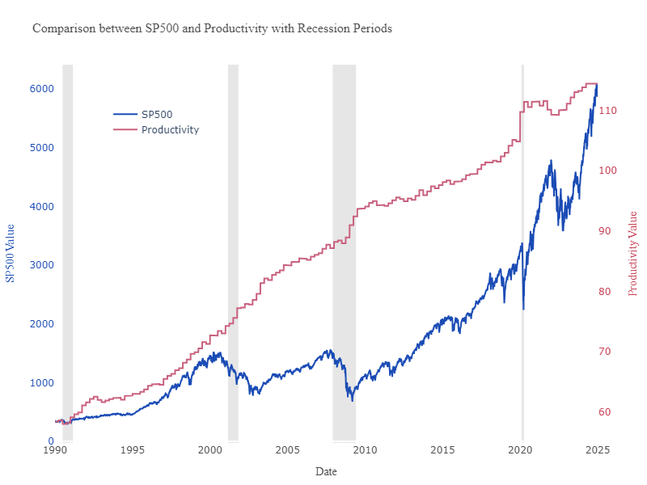
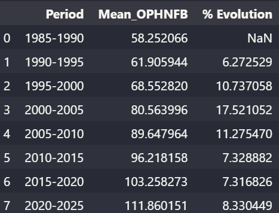
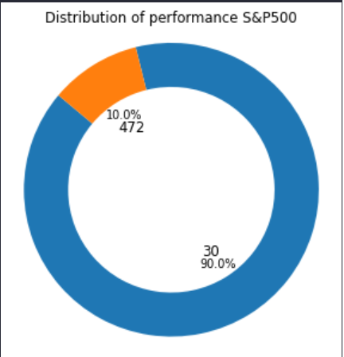
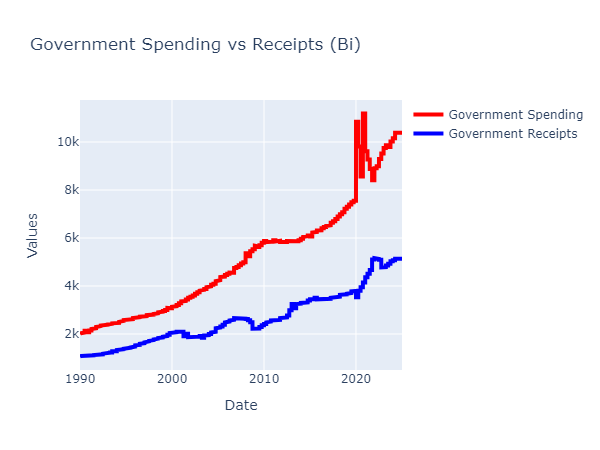

# US_economy_analysis_2025
An economy analysis made in python for U.S.

This analysis was made in python in 2025, to make an assessment of how well things are going in terms of stock markets, income, shares behavior, banking system, and so on... 

This is not a atempt to predict the future, but to understand what is our current scenario.

To run the complete analysis, do as it follow:

1. Download ou clone the repository
2. Install the libraries you may need with "pip install"
3. (Optional) If you want to run the extraction you will need to create API keys both in FRED and BLS, and add a .env with those keys in the same level of the project
4. Run "Data_analysis_US_economy.ipynb"

Here's a sample of the analysis:

This analysis take data from 1990 un til 2015, and the question I am trying to answer: **is it any point of major concern in the economy?**

And from this point I start analysing the S&P500, made a correlation with some indicators and one that I started with were productivity:

Clearly is the past years productivity goes up and also S&P500, but if we notice the pace of productivity is getting lower:

So I ran some analysis in some indicators to try to understand the causes and the impacts of this behavior, and in one of those analysis discover that 90% of the S&P500 performance was made by 30 companies

This is atonished, and sound pretty unatural, since in a highly competitive world the results tend to be disperse in many companies. So I decided to look at gonvernment indicators to understand if is any sign of stimulus of concentration coming from it.

And the analysis reveal many things, between them that the government spending is a lot higher than the receipts:

The complete analysis can be found [here]([https://www.example.com](https://medium.com/@curvelo.felipe20/u-s-economy-analysis-how-things-are-going-until-now-ea70e6ad1de3)).
